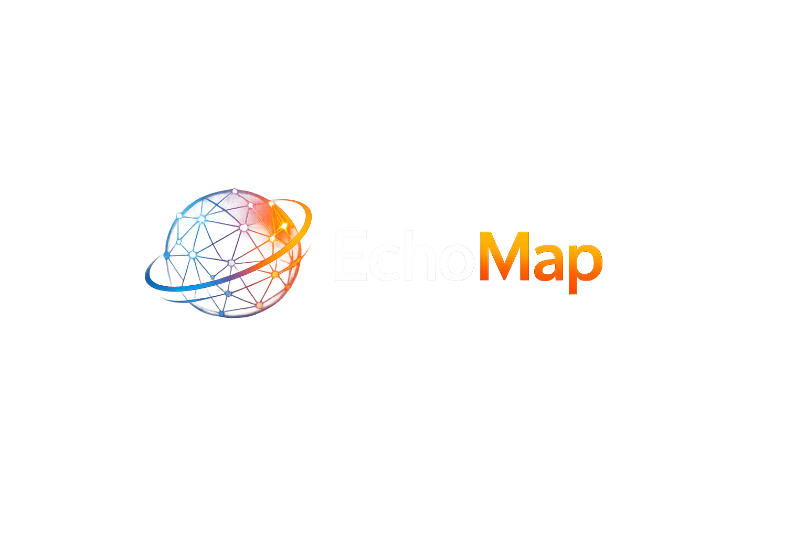
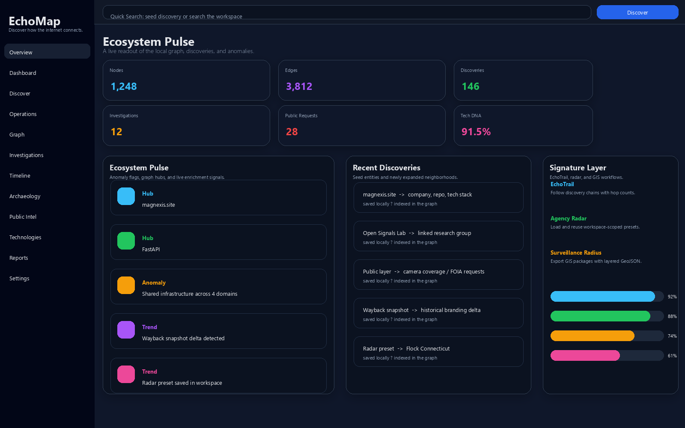
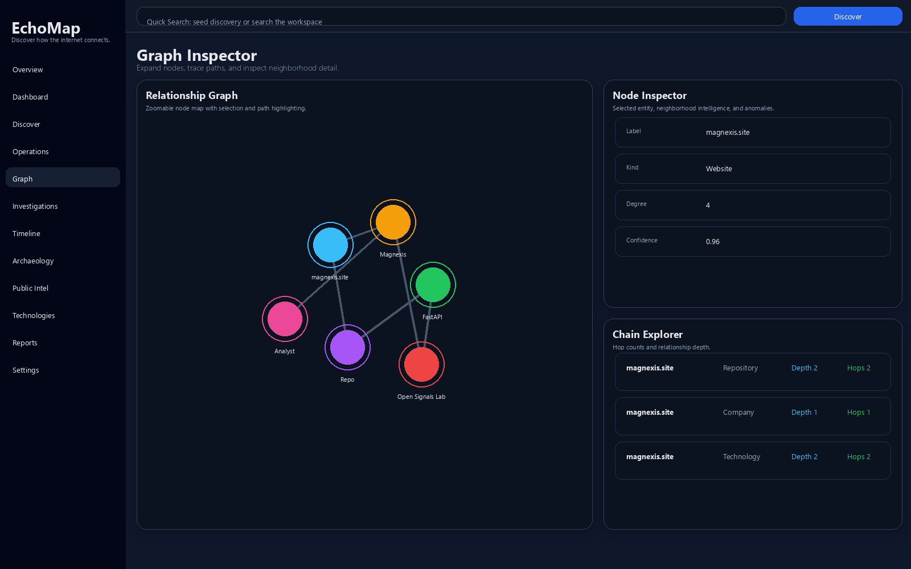
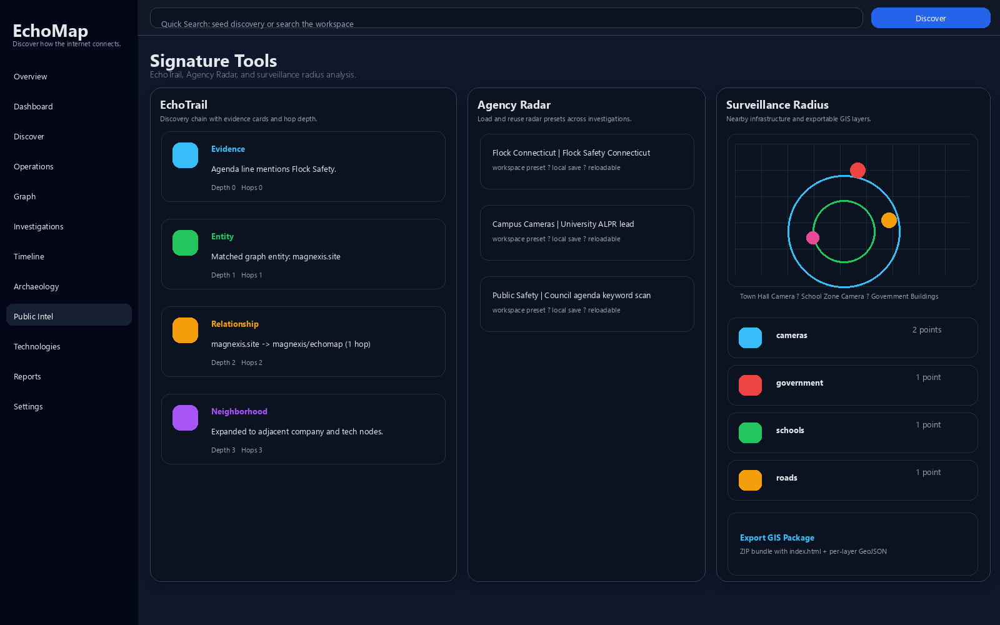
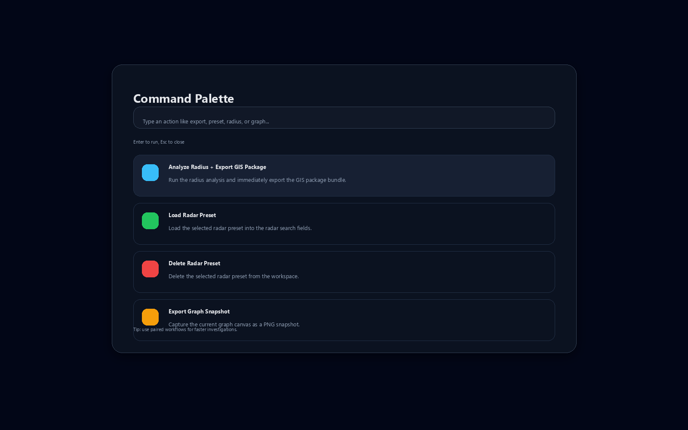

<p align="center">
  
</p>

# EchoMap

<p align="center">
  <a href="https://www.python.org/"></a>
  
  
  <a href="./pyproject.toml"></a>
  
  
  
  
  
  
  
  
  
  
  
</p>

EchoMap is a local-first desktop platform for discovering, mapping, and explaining relationships between websites, companies, repositories, technologies, and public internet resources.

It is designed to feel like a research operating system:

- start from one seed entity
- discover related nodes automatically
- preserve evidence locally
- analyze how the ecosystem evolved over time

It is built around one core question:

> How is this connected?

Instead of just identifying things, EchoMap tries to map the ecosystem around them:

- what exists
- who or what owns it
- what it references
- what it depends on
- how it changed over time
- what technologies power it
- what hidden relationships can be inferred from public data

At a glance, EchoMap combines:

- graph exploration and visual investigation
- background discovery and enrichment
- civic intelligence and public-record workflows
- geospatial analysis and exportable map packages
- CLI, API, and desktop interfaces backed by the same local graph

## What It Does

- Discovers sites, repos, companies, and technologies
- Builds a persistent local knowledge graph
- Expands neighborhoods automatically in the background
- Surfaces timeline, archaeology, and reporting views
- Adds an ecosystem overview with anomaly flags and graph scorecards
- Shows a live technology DNA profile for each discovery
- Supports saved investigations, bookmarks, and entity comparison mode
- Supports investigation tags, search, and live-vs-saved graph diffing
- Adds persistent workspaces so separate investigations stay isolated
- Supports automatic geocoding, duplicate detection, and tabular imports
- Adds agency profile pages, confidence scoring, and change detection
- Exports clean public map bundles in HTML, CSV, GeoJSON, and ZIP form
- Adds EchoTrail discovery tracing, Agency Radar clue search, and surveillance radius analysis
- Adds GIS-style overlays for radius analysis and workspace-scoped signature dashboards
- Lets you save and reload radar presets per workspace
- Traces shortest relationship paths between any two discovered entities
- Includes a command palette for quick actions
- Includes a graph minimap and graph snapshot export for reports
- Ships with an optional FastAPI backend service for graph access and automation
- Supports SQLite now, with backend abstraction for PostgreSQL and Neo4j

## UI Screenshots

<p align="center">
  
  
</p>

<p align="center">
  
  
</p>

These screenshots reflect the current desktop experience: the ecosystem overview, the graph inspector, the public intelligence tools, and the command palette.

## Core Model

EchoMap treats every discovery as part of a graph-first model:

- Nodes represent websites, domains, repositories, people, companies, technologies, and archive artifacts
- Edges represent relationships such as `uses`, `owned_by`, `references`, `connected_to`, and `built_with`
- Artifacts preserve historical evidence like Wayback snapshots, DNS records, and certificate transparency data
- Investigations preserve curated snapshots of the graph for later analysis and comparison

This design keeps the workspace focused on evidence, not just search results.

## Advanced Views

- **Graph**: draggable, zoomable node-link visualization with expand-on-click behavior
- **Graph Inspector**: dedicated detail drawer with node, edge, chains, and anomaly tabs, plus visible hop counts and depth labels
- **Overview**: scorecards, anomaly flags, and high-level graph health metrics
- **Investigations**: saved cases, tags, search, bookmarks, diffing, and export
- **Timeline**: discovery and archaeology events in chronological order
- **Archaeology**: historical snapshots and DNS / certificate evidence
- **Public Intel**: civic layers, FOIA requests, source citations, and playback
- **Reports**: JSON, Markdown, HTML, CSV, and PNG snapshot export
- **Settings**: theme toggles, background scanning controls, and backend snapshot visibility

## Relationship Intelligence

The discovery engine combines multiple signals into a single ecosystem view:

- domain normalization and parent-domain discovery
- GitHub repository and organization enrichment
- technology fingerprinting from HTML, headers, scripts, and metadata
- live archive evidence from Wayback, DNS snapshots, and certificate transparency sources
- public meeting agenda scanning for civic-tech and surveillance leads
- FOIA / public records request tracking with contract intelligence fields
- source citations attached to layers, requests, and document-derived entities
- timeline playback over discoveries, requests, citations, and archaeology events
- relationship path tracing between any two nodes in the graph
- similarity and comparison summaries for neighborhoods and full graph snapshots
- public intelligence workflows for FOIA tracking, agenda scanning, and civic research
- document-to-map ingestion for CSV, Excel, PDFs, and extracted text sources
- snapshot-based change detection for public pages, contracts, and agenda items
- exportable map packages with evidence bundles and geospatial outputs
- discovery trails that show how a clue flowed from agenda or contract to entity and location
- agency radar searches that surface likely agencies, vendors, and public clues from a keyword
- surveillance radius analysis around cameras, public buildings, and mapped infrastructure
- GIS overlay layers for schools, roads, neighborhoods, government sites, and camera coverage
- saved radar presets tied to the active workspace so repeat investigations stay fast
- command palette shortcuts for exporting GIS packages and loading or deleting radar presets
- command palette shortcuts for the paired Analyze Radius + Export GIS Package workflow

The result is a local intelligence workspace that can grow from one seed entity into a much larger map.

## Backend Architecture

EchoMap uses a split architecture so the desktop experience stays fast while the core graph logic stays portable:

- **PySide6 desktop shell** for the primary user experience
- **SQLite** as the default local persistence layer
- **FastAPI** as the optional service layer for programmatic access, automation, and future integrations
- **Backend abstraction** for PostgreSQL and Neo4j so the graph can later move beyond a single-file database without changing the app flow
- **Public intelligence workspace** stored locally by default so civic research stays private

FastAPI is the best fit here because it gives EchoMap:

- typed request/response models
- a clean JSON API for graph, trace, compare, investigation, and discovery workflows
- easy local deployment for desktop users
- a natural bridge to remote automation, scripting, or future web companions

The API is intentionally practical rather than generic. It exposes the same relationship-first primitives used by the desktop app:

- `GET /health`
- `GET /backend`
- `GET /stats`
- `GET /graph`
- `GET /nodes`
- `GET /edges`
- `GET /search/nodes`
- `GET /trace`
- `GET /compare/nodes`
- `GET /compare/graphs`
- `GET /reports/workspace`
- `GET /reports/investigations/{investigation_id}`
- `GET /reports/comparisons/{comparison_id}`
- `GET /public/layers`
- `GET /public/requests`
- `GET /public/citations`
- `GET/POST/DELETE /public/presets`
- `GET /public/presets/{preset_id}`
- `GET /public/agency/{name}`
- `GET /public/timeline`
- `GET /public/heatmap`
- `POST /public/geocode`
- `POST /public/import/tabular`
- `POST /public/change-detection`
- `POST /public/export`
- `POST /public/agenda/scan`
- `POST /public/documents/ingest`
- `POST /public/documents/text`
- `GET/POST/PATCH /workspaces`
- `POST /workspaces/{workspace_id}/activate`
- `GET/POST/PUT/DELETE /investigations`
- `GET/POST/DELETE /bookmarks`
- `POST /discover`
- `WS /ws/graph` for live graph snapshots and background discovery events

The desktop app can subscribe to this stream and auto-refresh the graph when the workspace changes.

## Live Updates

EchoMap now ships with a lightweight graph event hub that emits updates whenever the local workspace changes.

That means:

- discovery runs can publish progress in real time
- background scans can push graph changes as they land
- the FastAPI websocket can stream snapshot and event messages to external tools

This keeps the desktop app, API, and headless workflows aligned around one live event model instead of three separate code paths.

## Run

```powershell
python -m pip install -e .
echomap
```

To run the API service:

```powershell
python -m pip install -e .[api]
echomap-api
```

To run the headless CLI:

```powershell
echomap-cli stats
echomap-cli discover magnexis.site --save-investigation --title "Magnexis Seed"
echomap-cli export-investigation 1 --format md --output .\\exports\\magnexis-report.md
echomap-cli compare nodes node:a node:b --save
echomap-cli compare graphs 1 --live --save
echomap-cli report --live --format md --output .\\exports\\workspace-report.md
echomap-cli report --investigation-id 1 --format html --output .\\exports\\investigation-report.html
echomap-cli public scan-agenda --text "Flock cameras on the agenda" --title "City Council Agenda"
echomap-cli public ingest-text "Police Contract" "Camera system and data sharing"
echomap-cli public heatmap --input .\\exports\\points.json
echomap-cli public echotrail Flock
echomap-cli public radar "Flock Safety Connecticut"
echomap-cli public radius "East Haven, CT" --radius-km 2.0
echomap-cli public radius "East Haven, CT" --radius-km 2.0 --package .\\exports\\radius-package.zip
echomap-cli public presets save "Flock Connecticut" --query "Flock Safety Connecticut" --notes "Radar preset"
```

## Configuration

- `ECHOMAP_BACKEND=sqlite|postgresql|neo4j`
- `ECHOMAP_BACKEND_DSN=<dsn or uri>`
- `ECHOMAP_API_HOST=127.0.0.1`
- `ECHOMAP_API_PORT=8000`
- Optional native backend installs:
- `pip install -e .[api]`
- `pip install -e .[postgres]`
- `pip install -e .[neo4j]`
- `pip install -e .[intel]`
- `pip install -e .[geo]`
- `pip install -e .[all]`

## CLI

The `echomap-cli` entrypoint is designed for automated or scripted workflows.

Supported commands:

- `discover`: run discovery headlessly, persist the result, and optionally save an investigation
- `export-investigation`: export a saved investigation as JSON, Markdown, HTML, or CSV
- `compare`: compare nodes or saved investigation graphs and optionally save the result
- `report`: generate Markdown or HTML reports from the live workspace, a saved investigation, or a saved comparison
- `public`: scan agendas, ingest documents, and summarize heatmaps
- `public geocode`: turn a place, agency, or business name into coordinates
- `public import-table`: map rows from CSV or Excel into graph-ready records
- `public agency-profile`: build an evidence-rich profile for an agency or company
- `public change-detect`: compare two snapshots and store the current version
- `public export-map`: publish the current public map as HTML, CSV, GeoJSON, or ZIP
- `list-investigations`: print saved investigations to stdout
- `stats`: emit a compact JSON snapshot of the current workspace

CLI notes:

- `echomap-cli --version` prints the installed package version
- `echomap-cli report` defaults to the live workspace when no source flag is provided
- `report` supports live workspace reports, investigation reports, and saved comparison reports
- `public` supports agenda scanning, document ingest, manual text ingest, and heatmap summaries
- `public` also supports geocoding, tabular imports, agency profiles, change detection, and map exports
- `public echotrail`, `public radar`, and `public radius` power the signature discovery-trail and surveillance views
- `public radius --package` writes a portable HTML + GeoJSON GIS layer bundle
- `public presets` lets you save and reuse workspace-scoped radar presets through the API
- the Surveillance Radius tab includes a one-click GIS package export for the current analysis
- `workspaces` let you keep investigations, layers, and evidence isolated by project

Example:

```powershell
echomap-cli discover openai.com --save-investigation --title "OpenAI Ecosystem"
echomap-cli export-investigation 3 --format html --output .\\exports\\openai-report.html
echomap-cli compare graphs 3 --live
echomap-cli report --comparison-id 2 --format md --output .\\exports\\comparison-report.md
```

## Shortcuts

- `Ctrl+K` open command palette
- `Ctrl+1` open overview
- `Ctrl+2` open discover
- `Ctrl+3` open graph

## Notes

Current capabilities include:

- A PySide6 desktop shell with the main sections
- A local SQLite graph store
- Optional FastAPI service layer
- Best-effort website/GitHub discovery
- Technology fingerprinting with stack DNA profiles
- Interactive graph visualization and a navigation minimap
- Dedicated graph detail drawer with expandable relationship chains and saved annotations
- Command palette
- Saved investigations and bookmarks
- Comparison mode, including saved-vs-live graph diffs
- CLI compare workflows for node-level and graph-level analysis
- CLI report workflows for live graphs, investigations, and comparisons
- CLI public-intelligence workflows for agenda scans, document ingest, and heatmap summaries
- Investigation search and tagging
- Backend read snapshots for local and remote graph stores
- Timeline, archaeology, and report export views
- Public intelligence workspace with layers, FOIA requests, source citations, and timeline playback
- PNG graph snapshot export
- Optional PostgreSQL and Neo4j backend drivers
- Rich documentation and badge-based status signaling

## Status

EchoMap is actively being implemented. The current codebase now includes:

- Background scanning
- Archaeology persistence
- Node selection and expansion
- Backend abstraction scaffolding
- Local report exports
- Graph minimap navigation
- Live websocket-ready graph event streaming
- Desktop live sync with websocket-driven graph refreshes
- Discovery artifact history
